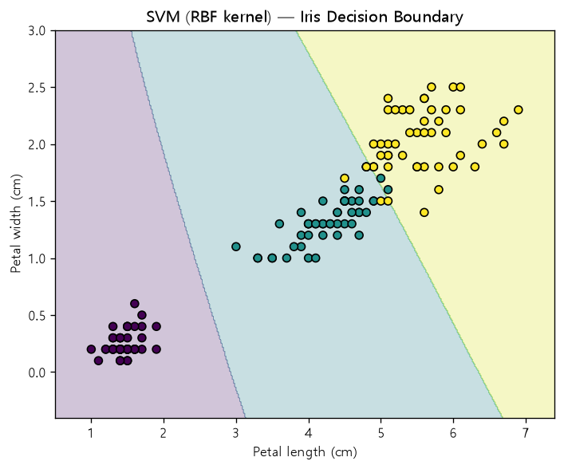
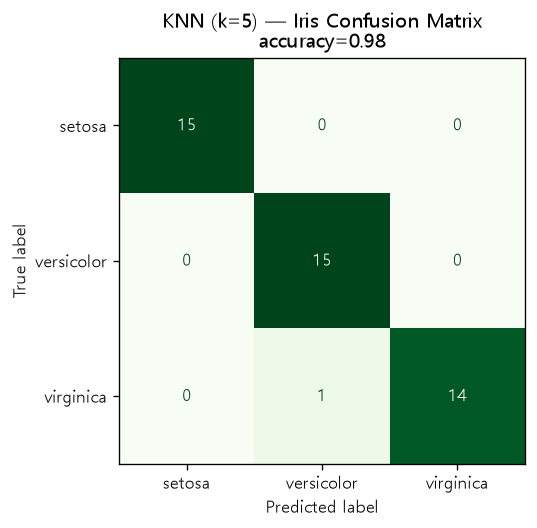
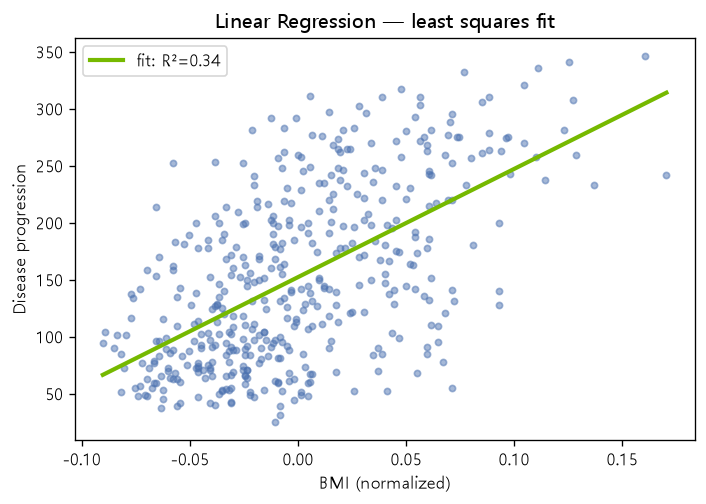
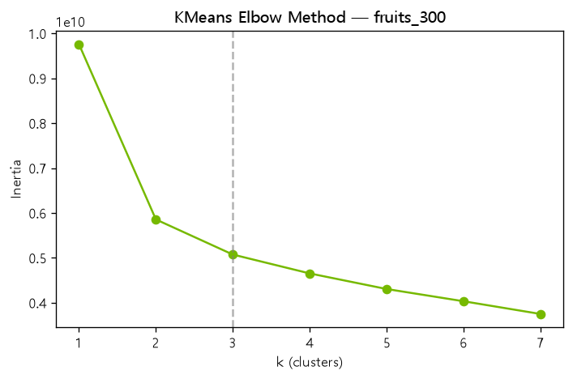
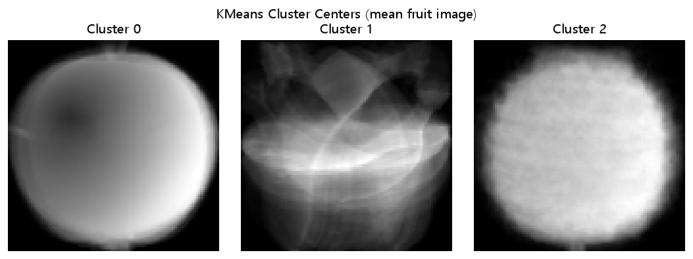

# 고전 머신러닝 with scikit-learn / Classical Machine Learning with scikit-learn

> **English summary** — A hands-on collection of classical machine-learning experiments built with **scikit-learn**, covering the full supervised/unsupervised spectrum: KNN classification & regression, linear / multiple-linear / logistic regression, SVM with RBF kernels and grid-search tuning, decision trees, softmax multiclass classification, and KMeans clustering. Each script loads a real dataset (iris, titanic, Kaggle Fish Market, a 300-image fruit array), trains a model, prints accuracy / confusion metrics, and renders a diagnostic plot (decision-boundary contours, regression lines, elbow curves). The repo also re-implements the math from scratch — MSE gradient descent, the sigmoid and softmax functions — to show what scikit-learn does under the hood. Code is organized by learning date under `src/`.


---

## 개요

이 저장소는 **scikit-learn**을 사용한 고전(전통) 머신러닝 실습 모음입니다. 딥러닝 이전의 기본기 —
데이터 분할, 정규화, 모델 학습·평가, 하이퍼파라미터 튜닝, 결과 시각화 — 를 알고리즘별로 직접 구현하며 정리했습니다.

핵심 관점은 두 가지입니다.

1. **scikit-learn API의 실전 흐름**: `train_test_split` → `StandardScaler` → `model.fit()` → `model.score()` → `predict()` 파이프라인을 분류/회귀/군집 문제 전반에 반복 적용.
2. **내부 동작을 직접 구현**: MSE 경사하강법, 시그모이드, 소프트맥스를 NumPy로 손수 짜서 라이브러리가 대신 해 주는 계산을 눈으로 확인.

코드는 `src/` 아래 학습 날짜 폴더(`20260604` ~ `20260609`)와 `src/KMeans_군집/`로 나뉘어 있습니다.

---

## 다룬 알고리즘

| 알고리즘 | 문제 유형 | 데이터셋 | 대표 파일 |
|---|---|---|---|
| KNN 분류 (`KNeighborsClassifier`) | 분류 | Fish Market (도미/빙어), iris | [train_test_split_exam.py](src/20260604/train_test_split_exam.py) · [knn_classifier_iris.py](src/20260604/knn_classifier_iris.py) |
| KNN + 표준점수 정규화 | 분류 (전처리) | Fish Market | [knn_standardscaled_exam.py](src/20260604/knn_standardscaled_exam.py) |
| KNN 회귀 (`KNeighborsRegressor`) | 회귀 | Fish Market (농어) | [knn_Regressor_exam.py](src/20260605/knn_Regressor_exam.py) |
| 단순 선형 회귀 (`LinearRegression`) | 회귀 | Fish Market (농어) | [sklearn_linearReg.py](src/20260605/sklearn_linearReg.py) |
| 다중 선형 회귀 (다항 특성 x², x) | 회귀 | Fish Market (농어) | [sklearn_MultiLinearReg.py](src/20260605/sklearn_MultiLinearReg.py) |
| MSE 경사하강법 (직접 구현) | 회귀 (from scratch) | 몸무게-키 샘플 | [MSE_경사하강_예제.py](src/20260605/MSE_경사하강_예제.py) |
| 로지스틱 회귀 (`LogisticRegression`) | 이진 분류 | titanic | [titanic_로지스틱회귀_이진분류.py](src/20260608/titanic_로지스틱회귀_이진분류.py) |
| 시그모이드 함수 (직접 구현) | 분류 기초 | 합성 x 구간 | [sigmoid_exam.py](src/20260608/sigmoid_exam.py) |
| SVM 분류 (RBF 커널) | 분류 | iris | [svm_iris_classfier.py](src/20260608/svm_iris_classfier.py) |
| SVM + 결정경계 등고선 시각화 | 분류 (시각화) | iris | [2.iris데이터_SVM분류_등고선시각화.py](src/20260608/2.iris데이터_SVM분류_등고선시각화.py) |
| SVM 하이퍼파라미터 튜닝 (`GridSearchCV`) | 분류 (튜닝) | iris | [svm_Gridsearch.py](src/20260608/svm_Gridsearch.py) |
| 결정 트리 (`DecisionTreeClassifier`) | 분류 | 서울 자치구 위경도 | [DecisionTree_모델분류.py](src/20260608/DecisionTree_모델분류.py) |
| 로지스틱 회귀 다중분류 (softmax) | 다중 분류 | Fish Market (7종) | [fish_data_다중분류.py](src/20260609/fish_data_다중분류.py) |
| 소프트맥스 함수 (직접 구현) | 다중 분류 기초 | 클래스별 Z값 샘플 | [softmax_exam.py](src/20260609/softmax_exam.py) |
| KMeans 군집 | 군집 (비지도) | fruits_300.npy | [1.KMeans_과일분류.py](src/KMeans_군집/1.KMeans_과일분류.py) |
| KMeans 클러스터 중심 | 군집 (비지도) | fruits_300.npy | [2.KMeans_클러스터중심.py](src/KMeans_군집/2.KMeans_클러스터중심.py) |
| 최적 K 찾기 (엘보우 / inertia) | 군집 (비지도) | fruits_300.npy | [4.최적_K_찾기.py](src/KMeans_군집/4.최적_K_찾기.py) |

보조 실습: [confusion_matrix_exam.py](src/20260604/confusion_matrix_exam.py) (혼동행렬·classification_report), [numpy_fancyindexing.py](src/20260604/numpy_fancyindexing.py) (불린/팬시 인덱싱).

---

## 데이터셋

| 데이터셋 | 설명 |
|---|---|
| **iris** | `sklearn.datasets.load_iris()`. 붓꽃 3종(setosa/versicolor/virginica)을 꽃잎 길이·너비(`petal_len`, `petal_wd`) 2개 특성으로 분류. KNN·SVM 실습의 기준 데이터. |
| **titanic** | `titanic_passengers.csv`. gender·Age·Pclass 등에서 생존 여부(`Survived`)를 예측. 원-핫 인코딩(`get_dummies`)과 결측치 처리(`dropna`) 전처리 포함. |
| **fish (Fish Market)** | Kaggle Fish Market 참조 데이터. 도미/빙어 길이·무게(KNN 분류), 농어 길이·무게(선형/KNN 회귀), 7종 물고기 5개 특성(`fish_data.csv`, 다중분류)으로 재사용. |
| **fruits_300.npy** | 사과·바나나·파인애플 이미지 300장을 100×100 픽셀 배열로 담은 NumPy 파일. `reshape(-1, 10000)`으로 펼쳐 KMeans 군집에 사용. |
| *(boston)* | 이번 저장소에는 실제로 사용되지 않았습니다. 회귀 실습은 Fish Market 농어 데이터로 진행. |

> titanic·fish CSV의 일부 스크립트는 원 학습 환경의 절대 경로(`/home/sckit/...`)를 참조합니다. 다른 환경에서 실행할 때는 저장소 내 CSV 경로로 바꿔 주세요.

---

## 결과 & 시각화

저장소 코드로 재현한 실제 시각화 결과입니다. (`results/`)

### 분류 — 결정경계 & 혼동행렬
| SVM (RBF) 결정경계 · Iris | KNN 혼동행렬 · Iris |
|:---:|:---:|
|  |  |

RBF 커널 SVM이 세 붓꽃 품종을 비선형 경계로 분리하고, KNN(k=5)의 예측을 혼동행렬로 검증했습니다.

### 회귀 — 최소제곱 적합


### 군집 — KMeans 엘보우 & 클러스터 중심
| 엘보우(최적 K 탐색) | 과일 클러스터 중심(평균 이미지) |
|:---:|:---:|
|  |  |

`fruits_300.npy`(사과·바나나·파인애플 각 100장)를 K=3으로 군집화하면, 각 클러스터 중심(평균 이미지)이 실제 과일 형태로 수렴합니다. 엘보우 그래프에서 inertia 감소가 완만해지는 지점(K≈3)이 최적 군집 수와 일치합니다.

> 위 그림은 `results/` 생성 코드(scikit-learn + matplotlib)로 만든 실제 출력입니다. 원본 실습 스크립트는 `sigmoid`/`softmax` 함수 곡선, 다중선형 회귀 등 추가 시각화도 포함합니다.

---

## 실행 방법

```bash
# 1) 의존성 설치
pip install -r requirements.txt

# 2) 개별 스크립트 실행 (예시)
python src/20260604/knn_classifier_iris.py
python src/20260608/2.iris데이터_SVM분류_등고선시각화.py
python src/KMeans_군집/4.최적_K_찾기.py
```

주의사항:
- `fruits_300.npy`를 참조하는 KMeans 스크립트는 `src/KMeans_군집/` 폴더에서 실행하는 것을 권장합니다(상대 경로 로드).
- titanic·fish CSV를 절대 경로로 읽는 스크립트는 실행 전 경로를 저장소 내 파일로 수정하세요.
- `fish_data_다중분류.py` 마지막 줄의 `tensorflow.keras` import는 다중분류 결과와 무관한 실험용 잔여 코드입니다.

---

## 배운 점

- **전처리가 성능을 만든다**: KNN처럼 거리 기반 모델은 특성 스케일에 민감 → `StandardScaler`(표준점수 정규화)를 적용하기 전/후 결과를 직접 비교하며 정규화의 필요성을 체감.
- **train/test 분리는 기본**: 모든 지도학습 실습에서 `train_test_split`으로 나누고 `random_state`를 고정해 재현 가능한 평가 수행.
- **같은 문제, 여러 모델**: 붓꽃 분류를 KNN·SVM으로, 물고기 무게 예측을 KNN 회귀·선형 회귀로 풀어 보며 모델별 특성과 한계를 비교.
- **하이퍼파라미터 튜닝**: `GridSearchCV`로 SVM의 `C`·`gamma`를 교차검증하며 자동 탐색 → 수작업 대신 체계적으로 최적 모델을 찾는 방법 학습.
- **라이브러리 안쪽 이해**: 경사하강법·시그모이드·소프트맥스를 NumPy로 직접 구현해, scikit-learn이 `fit()` 한 번에 처리하는 계산을 원리 수준에서 파악.
- **비지도학습 감각**: 정답 없이 KMeans로 과일을 군집하고 inertia·엘보우 방법으로 K를 정하는 흐름을 경험.

---

## 참고

- 같은 포트폴리오의 딥러닝 편: [deep-learning-keras](https://github.com/NvidiaSeoul/deep-learning-keras)
- Python·NumPy·pandas 기초: [ai-fundamentals](https://github.com/NvidiaSeoul/ai-fundamentals)

---

> NVIDIA AI Academy Seoul · Cohort 1 포트폴리오의 일부 — [전체 보기](https://github.com/NvidiaSeoul)
